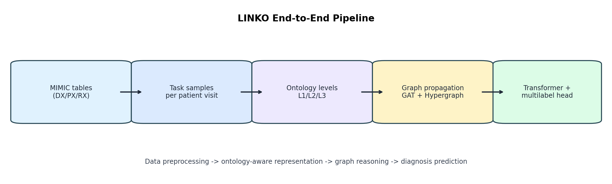
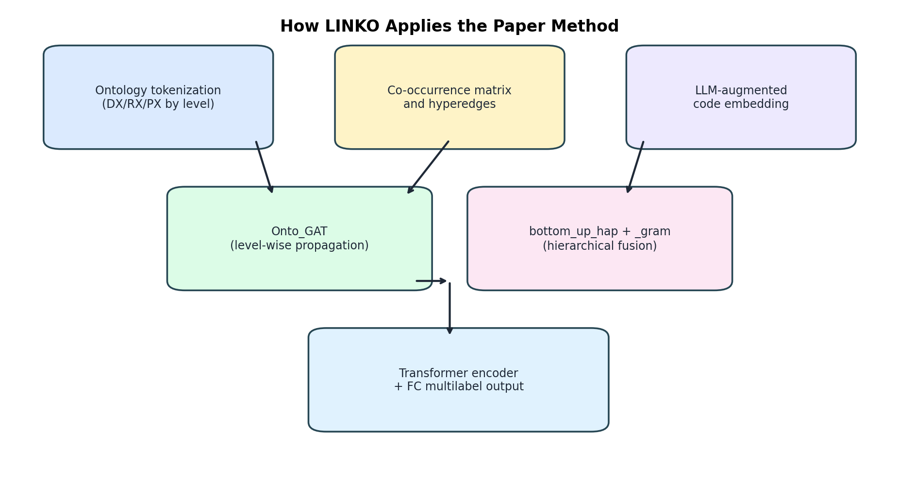
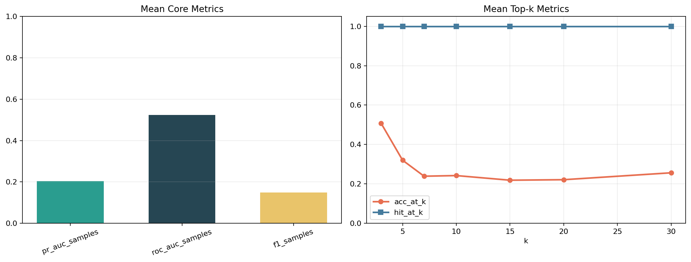
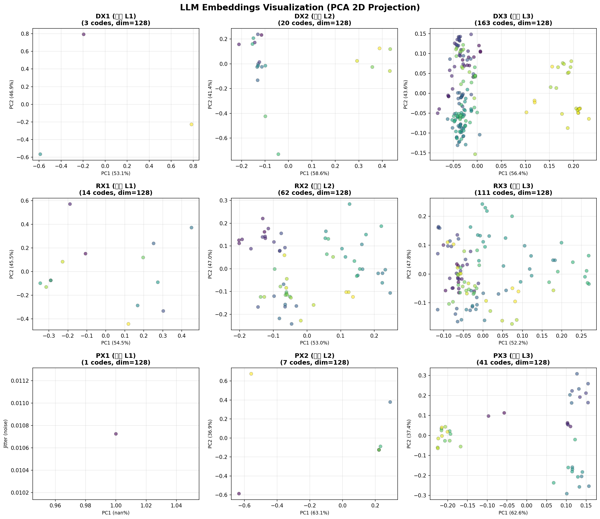

# LINKO (Demo/Subset Implementation)

다음 연구를 구현한 레포지토리입니다.

**Multi-Ontology Integration with Dual-Axis Propagation for Medical Concept Representation**

이 저장소는 LINKO 모델을 MIMIC-III 기반 데모/축소 환경에서 실행하고,
전처리-학습-평가-시각화 파이프라인이 실제로 동작하는지 검증하는 구현입니다.

---

## 1. Project Overview

LINKO는 환자 방문 이력을 단순 시계열로만 다루지 않고,
의료 온톨로지 구조와 코드 co-occurrence 관계를 함께 활용해 진단 예측 성능을 높이는 모델입니다.

핵심 아이디어는 다음과 같습니다.

- 진단, 처치, 약물 코드를 각각 온톨로지 레벨(`l1`, `l2`, `l3`)로 구성합니다.
- 레벨별 코드 임베딩을 만들고, 코드 간 관계를 그래프 전파로 반영합니다.
- 하이퍼그래프와 계층 전파를 결합해 레벨 간 정보를 통합합니다.
- 환자 방문 시퀀스를 Transformer로 인코딩해 다음 진단을 예측합니다.
- 다중 라벨 분류 기준으로 진단 코드 확률을 출력합니다.

---

## 2. 논문 방식이 코드에서 어떻게 쓰이는지

아래는 논문의 핵심 아이디어가 실제 코드에서 구현되는 위치입니다.

### 2.1 온톨로지 기반 코드 표현

- 진단(`conditions`), 약물(`drugs`), 처치(`procedures`)를 레벨별로 분해합니다.
- 레벨별 토크나이저와 임베딩을 초기화해 계층 정보를 표현합니다.

관련 파일:

```text
model/LINKO.py
```

핵심 함수:

- `_ontology_tables()`
- `_my_add_feature_transform_layer()`
- `_token_id_ontology_tables()`

### 2.2 코드 관계 그래프 전파

- 방문 단위 co-occurrence으로 조건부 확률 행렬을 만들고,
- GAT/Hypergraph 전파를 통해 코드 표현을 업데이트합니다.

관련 파일:

```text
model/LINKO.py
saved_files/conditional_prob_matrix.csv
saved_files/conditional_prob_matrix1.csv
saved_files/conditional_prob_matrix2.csv
```

핵심 함수:

- `get_co_occurrence()`
- `get_co_occurrence_for_parents()`
- `get_hyper_edges()`
- `Onto_GAT()`

### 2.3 이중 축 결합과 최종 예측

- 계층 축: `bottom_up_hap()`으로 레벨 간 부모-자식 정보를 결합합니다.
- 관계 축: `_gram()`에서 attention으로 레벨 표현을 통합합니다.
- 환자 축: `forward()`에서 방문 시퀀스를 Transformer로 인코딩하고 FC로 예측합니다.

관련 파일:

```text
model/LINKO.py
```

핵심 함수:

- `bottom_up_hap()`
- `_gram()`
- `forward()`

### 2.4 LLM 임베딩 보강

- 코드 설명 텍스트를 기반으로 임베딩을 생성하고,
- 실패 시 로컬 벡터화로 폴백해 학습 파이프라인 중단을 방지합니다.

관련 파일:

```text
model/LINKO.py
saved_files/gpt_code_emb/
```

핵심 함수:

- `_get_llm_emb()`
- `_get_gpt_embedding()`
- `creat_llm_emb()`

---

## 3. Project Structure

```text
LINKO-Implementation/
├─ model/
│  └─ LINKO.py
├─ train/
│  └─ train.py
├─ tasks/
│  └─ diagnosis_prediction.py
├─ utils/
│  ├─ data.py
│  ├─ eval_test.py
│  ├─ splitter.py
│  └─ visualize_results.py
├─ saved_files/
│  ├─ icd_maping/
│  ├─ ontology_tables/
│  ├─ mimic3_samples/
│  ├─ gpt_code_emb/
│  └─ conditional_prob_matrix*.csv
├─ results_prompting/
│  ├─ metrics_results_BestModel_OntoFAR_1.0.txt
│  ├─ metrics_results_BestModel_OntoFAR_1.0_summary.json
│  └─ metrics_results_BestModel_OntoFAR_1.0_summary.png
└─ README.md
```

설명:

- `model/`: LINKO 핵심 모델 구현
- `train/`: 학습 엔트리 포인트
- `tasks/`: MIMIC 진단 예측 태스크 샘플 구성
- `utils/`: 데이터 전처리/평가/시각화 보조 코드
- `saved_files/`: 매핑/캐시/임베딩/확률행렬 저장
- `results_prompting/`: 학습 결과 요약 산출물 저장

---

## 4. Environment Setup

### 4.1 가상환경 생성

Linux/macOS:

```bash
python -m venv .venv
source .venv/bin/activate
python -m pip install --upgrade pip
```

Windows PowerShell:

```powershell
python -m venv .venv
.\.venv\Scripts\Activate.ps1
python -m pip install --upgrade pip
```

### 4.2 패키지 설치

```bash
pip install -r requirements.txt
```

### 4.3 Ollama 실행

터미널 1:

```bash
ollama serve
```

터미널 2:

```bash
ollama run llama3.1
```

---

## 5. Data Preparation

원본 MIMIC-III 파일은 아래 경로에 배치합니다.

```text
datasets/MIMIC_III/
```

학습 스크립트는 아래 테이블을 사용합니다.

- `DIAGNOSES_ICD`
- `PROCEDURES_ICD`
- `PRESCRIPTIONS`

데이터셋 구성 및 태스크 변환 관련 파일:

```text
utils/data.py
tasks/diagnosis_prediction.py
```

---

## 6. Training

### 6.1 빠른 동작 확인 (권장)

Linux/macOS:

```bash
export PYTHONPATH=.
export MIMIC_DEV=1
export EPOCHS=1
export SMOKE_SEEDS=1
python train/train.py
```

Windows PowerShell:

```powershell
$env:PYTHONPATH='.'
$env:MIMIC_DEV='1'
$env:EPOCHS='1'
$env:SMOKE_SEEDS='1'
python train/train.py
```

### 6.2 전체 학습

```powershell
$env:PYTHONPATH='.'
$env:MIMIC_DEV='0'
$env:EPOCHS='230'
Remove-Item Env:SMOKE_SEEDS -ErrorAction SilentlyContinue
python train/train.py
```

결과 저장:

- 체크포인트: `output/OntoFAR_1.0/EXP_seed_<seed>/`
- 지표 요약: `results_prompting/`

---

## 7. 시각화 전에 파이프라인이 어떻게 작동하는지

이 섹션은 시각화 이전 단계에서 내부가 어떻게 동작하는지 설명합니다.

### 7.1 데이터 로드 및 샘플 생성

1. `MIMIC3Dataset` 로 원본 테이블을 로드합니다.
2. `customized_set_task_mimic3()` 로 환자 방문 시퀀스를 태스크 입력 형식으로 변환합니다.
3. seed 기준으로 train/val/test를 분할합니다.

관련 파일:

```text
train/train.py
utils/data.py
tasks/diagnosis_prediction.py
```

### 7.2 모델 초기화

1. 온톨로지 테이블과 레벨 토크나이저를 구성합니다.
2. co-occurrence 행렬을 로드하거나 생성합니다.
3. LLM 임베딩을 로드하거나 생성합니다.
4. GAT/Hypergraph/Transformer/FC 모듈을 초기화합니다.

관련 파일:

```text
model/LINKO.py
```

### 7.3 학습 루프

1. 배치 단위로 `forward()`를 호출합니다.
2. 모델은 코드 관계 전파와 시퀀스 인코딩을 수행합니다.
3. loss를 계산하고 optimizer로 업데이트합니다.
4. 검증 지표를 기준으로 best checkpoint를 갱신합니다.

관련 파일:

```text
train/train.py
model/LINKO.py
```

### 7.4 평가 및 결과 파일 생성

1. 검증/테스트 추론 결과로 metric을 계산합니다.
2. 평균 metric을 텍스트로 저장합니다.
3. 시각화 스크립트가 읽을 JSON/PNG를 생성합니다.

관련 파일:

```text
utils/eval_test.py
utils/visualize_results.py
results_prompting/metrics_results_BestModel_OntoFAR_1.0.txt
```

---

## 8. Visualization

README 설명과 연결되는 시각화 이미지는 아래 3개입니다.

```text
results_prompting/linko_pipeline_overview.png
results_prompting/linko_method_overview.png
results_prompting/metrics_results_BestModel_OntoFAR_1.0_summary.png
```

### 8.1 파이프라인 개요



- 데이터 로드에서 예측 헤드까지 전체 흐름을 한 장으로 확인할 수 있습니다.
- 전처리, 온톨로지 구성, 그래프 전파, 시퀀스 인코딩의 연결 관계를 보여줍니다.

### 8.2 논문 방식 적용 구조



- 온톨로지 토큰화, 공기출현/하이퍼엣지, LLM 임베딩, 계층 결합, 최종 예측의 순서를 시각화합니다.
- 논문 아이디어가 코드 블록으로 어떻게 배치되는지 이해할 때 유용합니다.

### 8.3 성능 요약 지표



- 왼쪽 그래프: `pr_auc_samples`, `roc_auc_samples`, `f1_samples` 평균 비교
- 오른쪽 그래프: `acc_at_k`, `hit_at_k`를 `k`별로 비교

결과 해석:

- 코어 지표에서는 `roc_auc_samples`가 약 `0.524`로 가장 높고, `pr_auc_samples`는 약 `0.203`, `f1_samples`는 약 `0.149` 수준입니다.
- 이 패턴은 클래스 불균형이 있는 환경에서 임계값 기반 분류 성능(`F1`)이 아직 제한적일 수 있음을 시사합니다.
- `acc_at_k`는 `k=3`에서 약 `0.508`로 시작해 `k`가 커질수록 완만하게 감소하는 경향을 보입니다. 이는 `k` 증가에 따라 분모가 함께 커지는 지표 특성으로 해석할 수 있습니다.
- `hit_at_k`는 상위 후보 안에 정답이 포함되는지 보는 지표이므로, 본 결과에서는 상위 후보군 포착 자체는 비교적 안정적인 편입니다.
- 다만 seed 간 신뢰구간(CI)이 일부 지표에서 넓게 나타나므로, 현재 수치는 절대 성능 확정보다 파이프라인 동작 검증 관점에서 해석하는 것이 안전합니다.

### 8.4 시각화 생성 방법

아래 명령은 README에 필요한 시각화 파일을 한 번에 생성합니다.

```bash
python utils/generate_readme_visuals.py --input results_prompting/metrics_results_BestModel_OntoFAR_1.0.txt --output-dir results_prompting
```

기존 요약 지표 시각화만 다시 만들고 싶다면 아래를 사용합니다.

```bash
python utils/visualize_results.py --input results_prompting/metrics_results_BestModel_OntoFAR_1.0.txt --output-dir results_prompting
```

### 8.5 LLM 임베딩 구조 시각화

#### 임베딩 파일 저장 위치

로컬 LLM(Ollama)으로 생성된 의료 코드 임베딩 벡터는 NumPy 바이너리 형식(`.npy`)으로 저장됩니다.

**저장 경로:**
```
saved_files/gpt_code_emb/tx-emb-3-small/include_all_parents2/
```

**파일 목록 (9개):**

| 파일명 | 설명 | 코드 개수 | 임베딩 차원 |
|-------|------|---------|------------|
| `dx1_gpt_emb.npy` | 진단 코드 레벨 1 (최상위) | 3 | 128 |
| `dx2_gpt_emb.npy` | 진단 코드 레벨 2 (중간) | 20 | 128 |
| `dx3_gpt_emb.npy` | 진단 코드 레벨 3 (세부) | 163 | 128 |
| `rx1_gpt_emb.npy` | 약물 코드 레벨 1 (최상위) | 14 | 128 |
| `rx2_gpt_emb.npy` | 약물 코드 레벨 2 (중간) | 62 | 128 |
| `rx3_gpt_emb.npy` | 약물 코드 레벨 3 (세부) | 111 | 128 |
| `px1_gpt_emb.npy` | 시술 코드 레벨 1 (최상위) | 1 | 128 |
| `px2_gpt_emb.npy` | 시술 코드 레벨 2 (중간) | 7 | 128 |
| `px3_gpt_emb.npy` | 시술 코드 레벨 3 (세부) | 41 | 128 |

#### 3-레벨 계층 구조의 의미

의료 코드 표준(ICD-9, ATC 등)은 자연스럽게 3단계 계층 구조를 가집니다:

- **L1 (최상위)**: 일반적 개념. 예: ICD-9 001-139 (감염성 질환)
- **L2 (중간)**: 더 구체적 범주. 예: ICD-9 050-052 (두창 관련)
- **L3 (세부)**: 임상에서 실제 사용하는 코드. 예: ICD-9 050.9 (두창 상세분류)

이 3단계를 **계층 전파**(`bottom_up_hap()`)로 결합하면:
- 세부 진단 관계 학습 (L3)
- 중간 범주 관계 (L2)
- 광범위 개념 정보 (L1)

레벨별 정보 손실 없이 **다양한 스케일의 의료 개념 관계**를 학습할 수 있습니다.

#### 임베딩 확인 및 시각화

아래 명령으로 모든 임베딩 파일의 PCA 2D 시각화를 생성합니다:

```bash
python visualize_embeddings.py
```

생성된 이미지:
```
results_prompting/embeddings_visualization.png
```



**시각화 해석:**

- **각 서브플롯**: 진단(DX), 약물(RX), 시술(PX)별로 3 row × 3 column 배치
- **데이터 포인트**: 각 의료 코드를 PCA로 2D로 축소한 것
- **색상**: 코드 인덱스 표현 (진한 파란색 = 낮은 인덱스, 황색 = 높은 인덱스)
- **PC1, PC2**: 각 주성분이 설명하는 분산 비율 표시 (보통 50~60%)

**주요 특징:**

- **L3 임베딩 (dx3, rx3, px3)**: 가장 많은 코드를 보유해 밀집된 군집 형태
- **L1 임베딩 (dx1, px1)**: 코드 개수가 적어서 희소한 분포
- **L2 임베딩**: L1과 L3 사이의 중간 밀도

#### Python에서 직접 확인

```python
import numpy as np

# 임베딩 로드
dx1_emb = np.load('saved_files/gpt_code_emb/tx-emb-3-small/include_all_parents2/dx1_gpt_emb.npy')

# 기본 정보
print(f"Shape: {dx1_emb.shape}")           # (3, 128)
print(f"Data Type: {dx1_emb.dtype}")       # float32
print(f"Min: {dx1_emb.min():.4f}, Max: {dx1_emb.max():.4f}")
print(f"Mean: {dx1_emb.mean():.4f}, Std: {dx1_emb.std():.4f}")

# 샘플 벡터
print(dx1_emb[0])  # 첫 번째 코드의 임베딩
```

---

## 9. Metric 설명

- `Recall@k` 계열: 상위 예측 목록에 정답 진단이 포함되는 비율
- `nDCG@k` 계열: 정답이 상위 순위에 배치되는 정도를 반영
- `PR-AUC`: 양성 클래스 희소 상황에서 정밀도-재현율 균형을 평가
- `ROC-AUC`: 임계값 전반에서 분류 성능을 평가
- `F1`: 정밀도와 재현율의 조화 평균

---

## 10. Limitations

- full-scale MIMIC 재현이 아닌 demo/subset 실행 안정화 목적 구현입니다.
- 데이터 크기가 작으면 metric 변동성이 커질 수 있습니다.
- 논문 수치와 절대값 비교보다는 파이프라인 동작 검증에 초점을 두는 것이 적절합니다.

---

## 11. Conclusion

이 프로젝트는 LINKO의 핵심 구조를 축소 환경에서 실행 가능하도록 구성하고,
데이터 전처리부터 학습/평가/시각화까지 전체 파이프라인이 정상 동작함을 확인한 구현입니다.

핵심적으로 확인한 사항:

- 온톨로지 레벨 기반 코드 표현이 정상적으로 구성됨
- 그래프 전파와 시퀀스 인코딩이 학습 루프에서 정상 동작함
- 평가지표 계산 및 결과 시각화가 재현 가능하게 생성됨
- 논문 구조 이해 및 실험 파이프라인 검증 용도로 적합함
